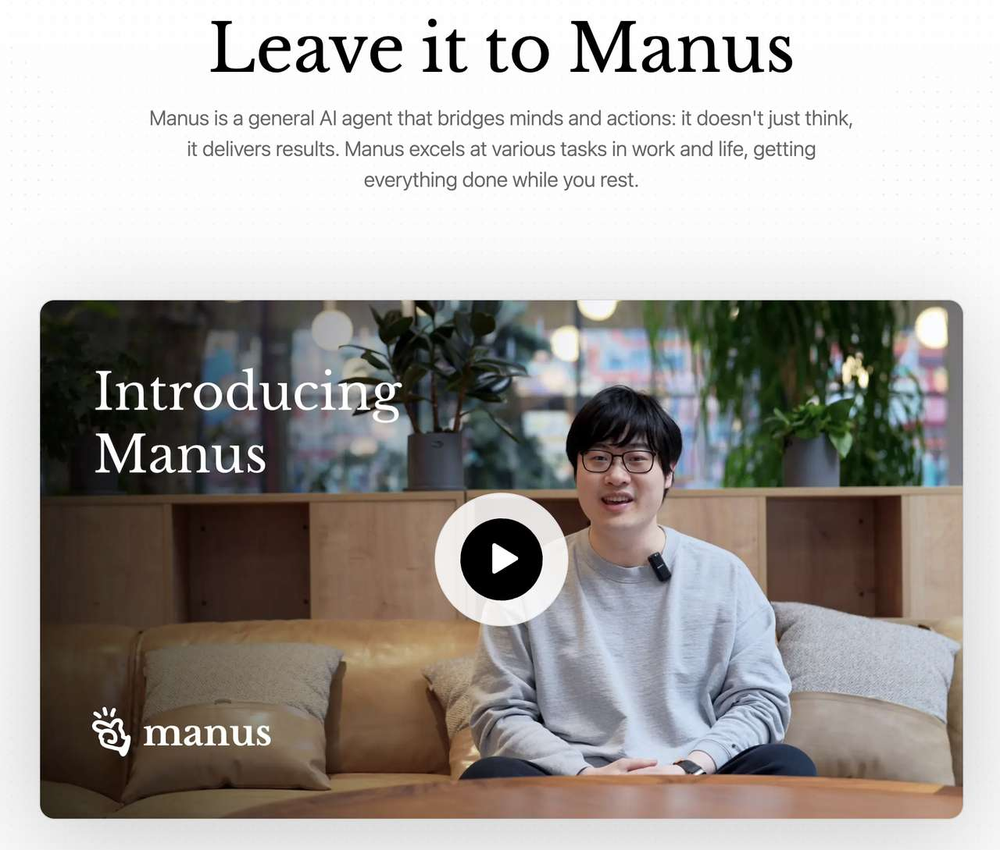
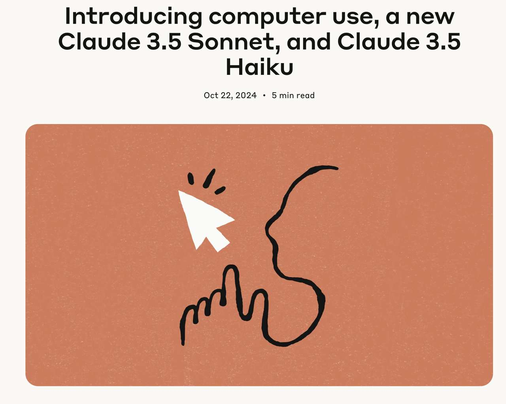
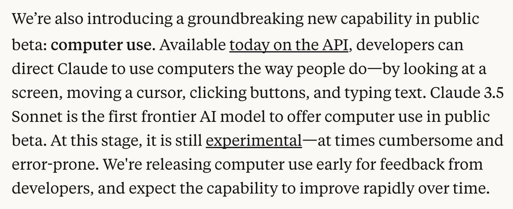
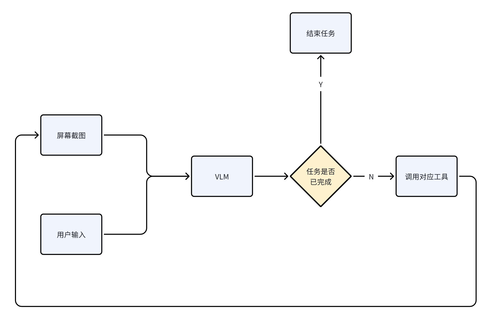
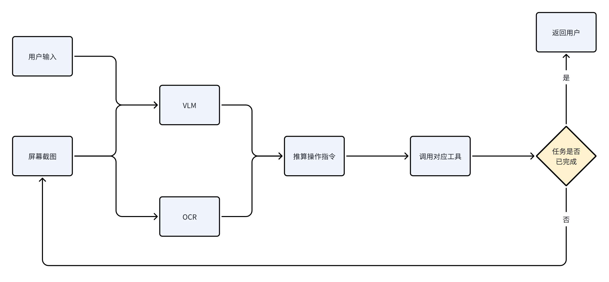
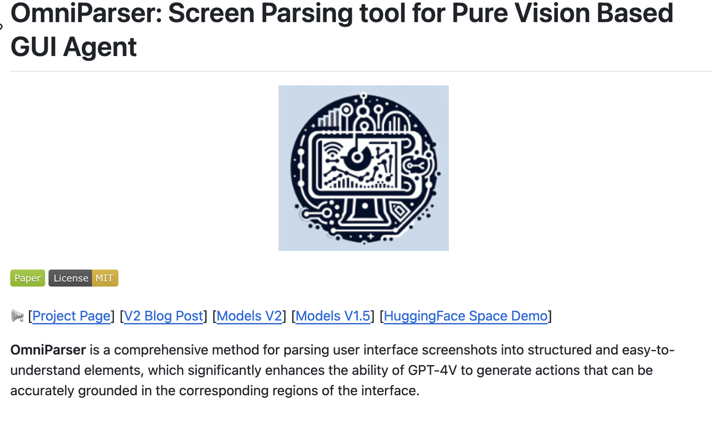

# Manus 爆火，再次证明 Computer Use Agent 的潜力

2025年3月4号晚，Monica.im 发布了一款通用型 AI Agent 产品： **Manus**(https://manus.im/)，从官网透露出的视频来看，这是一款**基于 Computer Use 实现**的 AI Agent，特点在于能够自主操作计算机完成更复杂的任务，例如做 PPT，分析股票市场变化，整理数据等。



本文无意探讨 Manus 的具体能力，毕竟咱也没试用过，没资格评价。今天我更想聊聊它背后的技术：Computer use，这个概念最早由 Anthropic 在 24年11月提出，虽然国内讨论的声浪并不大，但这种通过 LLM 自行操作计算机系统，进而实现更通用 Agent 能力的技术，却又非常大的想象空间，国外有不少厂商陆续跟进，做出了许多优秀作品。

我认为，Computer Use 将会成为未来 AI Agent 的一种重要设计模式，因此有必要更深入理解这一概念以及背后的执行原理。

## Computer Use 是什么

24年11月，Anthropic官宣了Claude 3.5的同时，也低调官宣了一个Beta版本的能力 Computer Use，目前处于公开测试阶段，这项功能允许 Claude 像人类一样使用计算机，具体表现为：用户可以指导 Claude 像人类一样使用计算机 —— 通过查看屏幕、移动光标、单击按钮和输入文本，来完成各类任务。

> https://www.anthropic.com/news/3-5-models-and-computer-use





这项技术旨在教会Claude通用的计算机操作技能，包括理解用户界面内容和执行界面交互，而无需为每种软件单独开发代理程序，这使得 Claude 模型得以实现：

1.  **跨平台界面解析**：基于计算机视觉实时识别GUI元素（按钮/输入框/菜单栏等），准确率达92%

    > 参考：https://www.mittrchina.com/news/detail/13924?locale=zh_CN
2.  **拟人化操作链**：构建「屏幕感知→光标定位→点击/输入→结果验证」的完整动作流：
3.  **自适应学习框架**：通过强化学习动态优化操作路径，处理非结构化界面时响应速度提升40%
4.  **双向反馈机制**：在执行过程中实时捕获屏幕变化，动态调整操作策略
5.  等等

特别适合替代人类完成一些常规计算机操作任务，如端到端测试（E2E）、自动化重复流程处理，以及将简单指令转化为复杂计算机指令等。

## Computer Use 解决了什么问题

Computer Use 技术**极具想象空间**，设想一套 Agent 软件就能将自然语言精确转换为复杂的系统操作指令，未来工作中可能不再需要耗费精力学习各类专业软件(如 excel、word等)的繁琐操作逻辑，只需以自然语言方式发出指令即可完成各种常见工作任务，AI 辐射范围将会进一步涵盖所有依赖计算机的工种。

也因此，多家团队正在积极探索推动这一技术落地应用：

- OpenAI 发布 [Operator](https://openai.com/index/introducing-operator)，可根据用户指令操纵浏览器：
- **Xlang Lab 发起**的 [Computer Agent Arena](https://arena.xlang.ai/leaderboard)；
- 开源 Agent [browser-use](https://github.com/browser-use/browser-use)，可根据用户指令操作浏览器；
- 以及最近刚发布的国产通用 Agent ：[Manus](https://manus.im/)
- 等等

甚至可以说，Computer Use 的设计算是对当前 AI 系统工具使用范式做了一次根本性重构，过去实现 LLM 与外部通讯手段多是集中在：function call、MCP 等技术，而这类技术都需要 case by case 地针对各类具体场景设计实现，而 computer use 则可以直接读取、操作电脑，就像一个极高性能又通用的人类一样，能够理解各种复杂计算机界面并完成任务，进而降低 agent 的开发成本(理论上)。

### 方案1：使用 VLM 模型

Computer Use Agent 重点在于理解计算机界面，因此通常强依赖于 VLM（[Vision-Language Model](https://huggingface.co/blog/vlms)）模型作为核心决策单元，通过多模态交互实现自动化的计算机操作。流程上整体遵循感知-决策-执行的控制范式：



大致包含三个步骤：

1.  **感知**：采用动态屏幕捕捉技术获取RGB像素流，通过GPU加速实现≤100ms的实时帧捕获，同步记录界面元数据（窗口层级/控件属性/焦点等）；
2.  **决策**：使用 VLM（[Vision-Language Model](https://huggingface.co/blog/vlms)） 实现界面元素检测（Faster R-CNN）+语义分割（Mask R-CNN），理解屏幕截图和用户输入，从而制定相应的行为策略，例如鼠标移动到哪里，点击哪里；在哪里输入文本等等；
3.  **执行**：最后，通过系统级输入驱动来执行相应的操作指令；

持续执行上述循环，直到大语言模型（LLM）判断任务完成、达到预设的最大操作次数，或超出上下文限制为止。

这种模式的优点是清晰简洁，容易理解上手。但是：**对VLM本身的能力要求非常高，需要能够可靠地识别****用户界面****中的可交互图标，以及理解屏幕截图中各种元素的语义，并准确地将预期作与屏幕上的相应区域相关联**，**想要实现精确点击和移动，难度很大。**

## 方案2：基于VLM与OCR融合的增强型 CUA

在上述 VLM 技术的基础上，我们还可以叠加 OCR 技术实现更精确的内容理解与定位操作，实现流程：

1.  截图
2.  基于视觉语言大模型（Vision-Language Model, VLM）+ OCR 实现多模态推理

    1.  输入屏幕快照与用户指令，生成操作指令集
    2.  当指令类型为指针交互时，模型输出结构化定位请求：

     ```json
     [{{ "reasoning": "cognitive process here", "action_type": "click", "target_text": "target element"}}]
     ```
    3.  结合OCR文本定位与视觉特征，进行坐标映射计算
3.  通过系统级输入驱动执行操作指令

直至LLM认为任务完成，或者达到设定的最大行为次数，或者超出上下文上限。



这个过程中，VLM作为系统的认知中枢，负责跨模态信息融合相关的工作，包括视觉-语言对齐、指令上下文建模与推理、隐含需求推理等；而 OCR 主要负责解析界面文本信息的原子化解析，解决字形干扰、多语言支持、艺术字体解析等问题，进一步提升结果的准确度。

## 方案3：使用 MicroSoft Omniparser V2 实现 CUA

2025年2月，Microsoft研究院发布[Omniparser V2](https://www.microsoft.com/en-us/research/articles/omniparser-v2-turning-any-llm-into-a-computer-use-agent/)范式转换技术，可将任意大型语言模型（LLM）转化为能直接操作计算机的智能代理。它通过实时解析屏幕界面元素（如按钮、图标），将其转化为结构化数据，使AI能理解用户指令并执行点击、输入等操作，无需针对特定界面微调。该技术显著提升了处理效率（延迟降低60%）和精准度（在复杂界面测试中达先进水平），成为实现跨平台、跨应用的智能自动化操作的核心工具。



本质上，OmniParser 与上面提到的 VLM 与 ocr 等技术相似，只是实现精度、准确度更高一些，整体逻辑：

1.  执行动态屏幕状态捕获（ScreenState Capture）
2.  通过OmniParser V2进行多模态界面解析，输出符合W3C ARIA标准的可交互元素元数据：

3.  构建VLM推理上下文
4.  调用系统级输入模拟引擎执行操作

## 总结

或许在未来，Computer Use 这种"所见即所控"的模式将彻底重构人机协作边界，并且很可能催生新的操作系统范式——AI将作为原生交互层直接驾驭数字世界。

不过就当下而言，各家产品都存在比较严重的性能问题，交互效率并不高，可以保持观望吧。对程序员群体而言，也应该理解 CUA 未来可能会成为一种主流 Agent 架构，值得提前投入精力学习。
