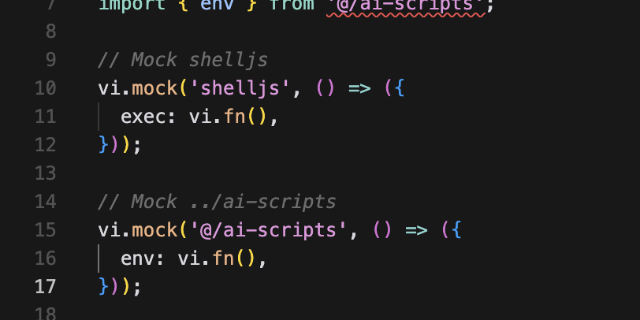

# [最佳实践] 更高效使用 Cursor 生成 UT

我是范文杰，一个专注于 AI 辅助编程与前端工程化领域的工程师！**欢迎关注**：


- [Cursor 深度评测：革命性提效工具还是过誉的玩具？](https://mp.weixin.qq.com/s/oobp66ylUzAnJUtwEB64Fw)
- [两个 Prompt 实现 Cursor 批量生成单测](https://mp.weixin.qq.com/s/xPcZumj6MHsaeLkmRTrv-w)

## 背景

单元测试(Unit Test)是一种用于测试软件最小可测试单元的方法与技术，通常针对一个函数、类、模块粒度展开，内容上基本遵循三步法：**设定上下文(Arrange)、执行代码单元（Act）、观测返回值或 Side-Effect 是否符合预期(Assert)** ，进而验证代码效果是否符合设计预期。

那么，为什么要在业务代码之外，费劲巴拉写单测呢？《单元测试的艺术(https://book.douban.com/subject/25934516/）》书中提到一个案例：两个研发能力相近的团队，同时开发相似需求，实施单测团队开发时间增加1倍，但集成测试阶段 bug 少，调试定位速度更快，最终交付时间和bug数均表现更好：


诚然，编写单测代码确实有较高的时间人力成本，但一方面单测能在开发阶段快速反馈代码的正确性，发现代码中的逻辑错误、边界条件处理不当等问题，起到查漏补缺效果，最终交付出质量更好的代码；另一方面，在后续维护过程中，无论是业务迭代、技术优化，都能规避意外改动引入的质量风险；以及更重要的，单测越完善重构成本越低，更容易引入各类 LLM 工具自动化地完成各种重复任务(例如：移除 FG、批量重构变量名、自动提取公共方法等)，项目的生命力也就越强。


> 从质量和长期可维护角度考虑，单测的 ROI 是非常高的。

过去我们总说写单测很难很麻烦，但当下，在 Cursor、Marscode 等辅助编码工具的加持下，只要**使用恰当的 Prompt 配合一些实践技巧**，开发者少量介入甚至完全无需介入即可生成质量不错的单元测试代码，生成/编写单测的时间成本已经急剧下降。因此，强烈建议将单测视作必要项目的必要组成部分，日常提交业务代码时应习惯性地同步补充单测代码(推荐由 AI 生成)，保证较高的单测覆盖率。

在后续章节中，我会总结若干基于 AI 生成 UT 的最佳实践与技巧，帮助各位更高效地借助 cursor 生成单测。

## 使用 Cursor 生成单测

目前市面上已经出现了很多辅助编程工具，cursor、windsuft、cline 等，但体验下来 Cursor 的自动化程度最高，效果最好，所以这里以 Cursor 为例，介绍如何生成单测，前置步骤：

1.  安装 cursor；
2.  开启 codebase indexing，这能让 Cursor 更好地理解整个仓库，也能让 Cursor 有机会学习存量单测代码的写法；
3.  开启 cursor yolo 模式(要求 0.43 以上版本)，这是一个强大的 AI Agent，能自行调用各类工具(eslint/ts/vitest 等)判断生成代码的合法性；


4.  编写适当的 `.cursorrules` 文件；
5.  模型切换为 `claude`；
6.  打开目标文件后，`ctrl + i` 打开 composer 面板，输入 prompt：

```JavaScript
为 @xxx 文件生成单测

// 或者

为 @xxx 包生成单测
为 @xxx 目录生成单测
```


到这里相信已经能生成一些单测代码，简单场景通常能一遍过，但遇到复杂场景时，生成效果可能并不好，例如源码中存在递归逻辑时，生成的质量通常很差，这是因为 LLM 是基于概率演算的，并不真正具有逻辑推导能力，严格来说并不具备分析复杂代码并生成相应单测的能力，对此我们可以借助一些实践方法，写出一些更适合 LLM 推导单测的源码；同时使用各类技巧更高效地调试单测代码直至完善所有测试用例，进一步降低单测开发成本。

## 前置准备

### 1.  以 Vitest 为测试框架

Vitest 是一个面向现代前端项目的测试框架，设计上与 Vite 兼容，并且致力于提供高性能、易于配置的测试环境。它使用 esbuild 进行快速编译，并且支持许多现代 JavaScript 和 TypeScript 特性。作为对比，Jest 是一个老牌的 JS 测试框架，功能齐全但执行速度相对较慢，且依赖结构非常复杂，难以维护管理。两者详细对比：

<table class="ace-table" data-ace-table-col-widths="200;265;313" style="border:none;border-collapse:collapse;table-layout:fixed;width:500px;"><colgroup><col width="200"><col width="265"><col width="313"></colgroup><tbody><tr style="height:39px;"><td colspan="1" rowspan="1" style="border:1px solid rgb(222, 224, 227);font-size:10pt;padding:8px;vertical-align:top;"><div style="text-align:left" class="ace-line ace-line old-record-id-EibddZpuCoD7d0xtaKCcd89Gnsb">特性</div></td><td colspan="1" rowspan="1" style="border:1px solid rgb(222, 224, 227);font-size:10pt;padding:8px;vertical-align:top;"><div style="text-align:left" class="ace-line ace-line old-record-id-GQNWdJrfQoeYB4xMyYMckXBpnnh">Jest</div></td><td colspan="1" rowspan="1" style="border:1px solid rgb(222, 224, 227);font-size:10pt;padding:8px;vertical-align:top;"><div style="text-align:left" class="ace-line ace-line old-record-id-BLa4d2sTro9i3oxhjh4crJNYnUg">Vitest</div></td></tr><tr style="height:39px;"><td colspan="1" rowspan="1" style="border:1px solid rgb(222, 224, 227);font-size:10pt;padding:8px;vertical-align:top;"><div style="text-align:left" class="ace-line ace-line old-record-id-H7PQd2O1Do8SkoxVDk5cAPoIn7d">性能</div></td><td colspan="1" rowspan="1" style="border:1px solid rgb(222, 224, 227);font-size:10pt;padding:8px;vertical-align:top;"><div style="text-align:left" class="ace-line ace-line old-record-id-PmCYdTXleoyLGhx0oWscsftAnoa">慢一些，使用 Babel 编译</div></td><td colspan="1" rowspan="1" style="border:1px solid rgb(222, 224, 227);font-size:10pt;padding:8px;vertical-align:top;"><div style="text-align:left" class="ace-line ace-line old-record-id-AEPvdMcxooOa2HxRzM8csi1Kngd">快速，使用 esbuild</div></td></tr><tr style="height:39px;"><td colspan="1" rowspan="1" style="border:1px solid rgb(222, 224, 227);font-size:10pt;padding:8px;vertical-align:top;"><div style="text-align:left" class="ace-line ace-line old-record-id-Kvm2dwKRSoZ9ScxR1KVcYkdAnme">现代化支持</div></td><td colspan="1" rowspan="1" style="border:1px solid rgb(222, 224, 227);font-size:10pt;padding:8px;vertical-align:top;"><div style="text-align:left" class="ace-line ace-line old-record-id-W79FdWLMhoFahgx8S7ScUpYknIg">部分 ESM 支持</div></td><td colspan="1" rowspan="1" style="border:1px solid rgb(222, 224, 227);font-size:10pt;padding:8px;vertical-align:top;"><div style="text-align:left" class="ace-line ace-line old-record-id-HRObd9whIo5KvYxHvtrcOZOTnJb">原生 ESM 支持</div></td></tr><tr style="height:39px;"><td colspan="1" rowspan="1" style="border:1px solid rgb(222, 224, 227);font-size:10pt;padding:8px;vertical-align:top;"><div style="text-align:left" class="ace-line ace-line old-record-id-OrWGdEd1Co940Axzclsc4sZ6nUE">与 Vite 集成</div></td><td colspan="1" rowspan="1" style="border:1px solid rgb(222, 224, 227);font-size:10pt;padding:8px;vertical-align:top;"><div style="text-align:left" class="ace-line ace-line old-record-id-SEpxdAN86oRbb5x9lgGcA5ZLngc">必须手动配置</div></td><td colspan="1" rowspan="1" style="border:1px solid rgb(222, 224, 227);font-size:10pt;padding:8px;vertical-align:top;"><div style="text-align:left" class="ace-line ace-line old-record-id-In6HdMeQLoePD2xaUkkc69T4nPc">原生支持，几乎零配置</div></td></tr><tr style="height:39px;"><td colspan="1" rowspan="1" style="border:1px solid rgb(222, 224, 227);font-size:10pt;padding:8px;vertical-align:top;"><div style="text-align:left" class="ace-line ace-line old-record-id-C9jCdYpvxozKPIxjiHfc6Fk2nP7">TypeScript 支持</div></td><td colspan="1" rowspan="1" style="border:1px solid rgb(222, 224, 227);font-size:10pt;padding:8px;vertical-align:top;"><div style="text-align:left" class="ace-line ace-line old-record-id-CFHida7NborGWLxIRQEcallrn0c">通过 ts-jest 或 Babel</div></td><td colspan="1" rowspan="1" style="border:1px solid rgb(222, 224, 227);font-size:10pt;padding:8px;vertical-align:top;"><div style="text-align:left" class="ace-line ace-line old-record-id-IIaqdkfbPo1YsKxXgAhcwjgxnmg">原生支持</div></td></tr><tr style="height:39px;"><td colspan="1" rowspan="1" style="border:1px solid rgb(222, 224, 227);font-size:10pt;padding:8px;vertical-align:top;"><div style="text-align:left" class="ace-line ace-line old-record-id-Hsh7d5pyUo8FPpx6wwScnMqWn7g">插件生态</div></td><td colspan="1" rowspan="1" style="border:1px solid rgb(222, 224, 227);font-size:10pt;padding:8px;vertical-align:top;"><div style="text-align:left" class="ace-line ace-line old-record-id-Ebn2d1bEPoF97LxPbkPcfFKpnKc">独立的插件生态</div></td><td colspan="1" rowspan="1" style="border:1px solid rgb(222, 224, 227);font-size:10pt;padding:8px;vertical-align:top;"><div style="text-align:left" class="ace-line ace-line old-record-id-TvEad8LmhoUuhmxWIOacxD7pnyg">与 Vite 共享插件生态</div></td></tr><tr style="height:39px;"><td colspan="1" rowspan="1" style="border:1px solid rgb(222, 224, 227);font-size:10pt;padding:8px;vertical-align:top;"><div style="text-align:left" class="ace-line ace-line old-record-id-EiNMdDAMBow1cZxM4Cbcd9Lgnuh">开发体验</div></td><td colspan="1" rowspan="1" style="border:1px solid rgb(222, 224, 227);font-size:10pt;padding:8px;vertical-align:top;"><div style="text-align:left" class="ace-line ace-line old-record-id-Ajm3dEyFBo9ZoQxTHf7cg5ugnSE">稍微慢一些</div></td><td colspan="1" rowspan="1" style="border:1px solid rgb(222, 224, 227);font-size:10pt;padding:8px;vertical-align:top;"><div style="text-align:left" class="ace-line ace-line old-record-id-LB1jd59wOof7u6x5HLUcqoXnnJb">更快的反馈循环</div></td></tr><tr style="height:39px;"><td colspan="1" rowspan="1" style="border:1px solid rgb(222, 224, 227);font-size:10pt;padding:8px;vertical-align:top;"><div class="ace-line ace-line old-record-id-TRFYdOsuVoKPdHx6xUVcCDbEn8c">依赖结构</div></td><td colspan="1" rowspan="1" style="border:1px solid rgb(222, 224, 227);font-size:10pt;padding:8px;vertical-align:top;"><div class="ace-line ace-line old-record-id-L841dYLl1omeYfxlzPucOU3fnPc">安装 Jest 后会递归安装许多下游依赖，结构复杂度较高</div></td><td colspan="1" rowspan="1" style="border:1px solid rgb(222, 224, 227);font-size:10pt;padding:8px;vertical-align:top;"><div class="ace-line ace-line old-record-id-X3LhdYxwNoSGVaxbOk9c3kXEnub">许多代码都被 Bundle 进 Vitest 的产物包，因此依赖结构要简单的多</div></td></tr></tbody></table>

因此，我个人更推荐使用 Vitest 作为测试框架，虽然也遇到了不少问题，但整体还是比较高效丝滑的。

### 2.  做好技术选型

在 vitest 之外，如果测试的主题是 React 组件，那么还需要引入更多工具实现组件渲染、hook 执行等逻辑，这里罗列几个你很可能会用到的工具：

- `@testing-library/react`：提供一系列方法用于渲染 React 组件，并且可以方便地查询和操作渲染后的组件实例(使用 `render`)；同时支持测试组件的交互逻辑(`fireEvent`)，比如模拟用户的点击、输入等操作，从而验证组件在不同交互下的行为是否符合预期；

```JavaScript
// https://web-bnpm.byted.org/package/@testing-library/react
import { render, fireEvent } from '@testing-library/react';

import { Button } from '../src/button';

describe('testing button', () => {
it('测试Button组件的文本和点击事件', () => {
  const mockOnClick = vi.fn();
  const { getByText } = render(
    <Button text="Submit" onClick={mockOnClick} />,
  );

  // 检查props.text是否正确渲染到按钮上
  const buttonNode = getByText('Submit');
  expect(buttonNode).not.toBeNull();

  // 触发点击事件，检查props.onClick是否被调用
  fireEvent.click(buttonNode);
  expect(mockOnClick).toHaveBeenCalledTimes(1);
});
});
```
- `@testing-library/react-hooks`：专门用于测试 React Hooks 的库，主要提供 `renderHook` 方法，可使用该方法调用要测试的 Hook，并获取其返回值、状态以及副作用等信息，并且允许测试不同依赖变化后 Hook 的行为；

```JavaScript
// https://web-bnpm.byted.org/package/@testing-library/react-hooks
import { renderHook, act } from '@testing-library/react-hooks';

import { useCounter } from '../src/use-counter';

test('测试useCounter自定义hook', () => {
const { result } = renderHook(useCounter);

// 初始值为0
expect(result.current.count).toBe(0);

// 执行increment操作，计数值应增加1
act(() => {
  result.current.increment();
});

expect(result.current.count).toBe(1);
});
```
- `@testing-library/user-event`：用于模拟用户与应用程序交互的库，可模拟各类用户操作如点击、输入文本、选择下拉选项等。相对而言，`@testing-library/react` 的 `fireEvent` 适用于测试组件内部状态流转触发的各类响应事件逻辑，而 `@testing-library/user-event` 更适用于测试真实用户交互所引发的副作用；

  ```JavaScript
  it('should handle quick jump correctly', async () => {
    const onPageChange = vi.fn();
    render(
      <Pagination total={100} showQuickJumper={true} onChange={onPageChange} />,
    );

    const input = screen.getByRole('spinbutton');
    await userEvent.clear(input);
    await userEvent.type(input, '5');
    await userEvent.keyboard('{Enter}');

    await waitFor(
      () => {
        expect(onPageChange).toHaveBeenCalledWith(5, 10);
      },
      { timeout: 1000 },
    );
  });
  ```
- `@testing-library/jest-dom`：这是一个与 Jest 和 DOM 测试相关的库，提供了一系列自定义的 Jest 匹配器（断言函数），这些匹配器使得对 DOM 元素的断言更加简洁和直观。例如，`toBeInTheDocument` 匹配器可以用来检查某个元素是否在渲染后的 DOM 中；`toHaveTextContent` 可以用来验证元素是否包含特定的文本内容；

```JavaScript
import '@testing-library/jest-dom';

it('should render the <ConfigPanel/> when `opening` is true', () => {
const { getByRole } = render(<RootContainer />);
// Show Indicator by default
expect(screen.getByText('Indicator')).toBeInTheDocument();

// Show ConfigPanel after clicking Indicator
fireEvent.click(getByRole('button')); // Assuming Indicator component is a button
expect(screen.getByText('ConfigPanel')).toBeInTheDocument();

// Show Indicator after clicking ConfigPanel
fireEvent.click(getByRole('button')); // Assuming ConfigPanel component is a button
expect(screen.getByText('Indicator')).toBeInTheDocument();
});
```

读者按需选用即可。

### 3.  目录结构

Vitest 会自动识别你的package 下面所有以test.ts 结尾的文件，理论来说，你可以按照自己的喜好进行组织，但这里建议：

1.  在 pakcage 根目录下设立 `__tests__` 文件夹，与 `src` 同级；
2.  Package 内所有的测试用例，都保存在上一步创建的文件夹中；
3.  为 `src` 目录每一个源码模块 `foo.ts`，创建对应同名测试模块 `foo.test.ts`，且测试代码的目录结构与源码保持一致，方便对应；
4.  所有单测文件名均以 `test.ts` 结束；

最终形成如下结构：

```JavaScript
infra/xxx-devtool/
├── README.md
├── OWNERS
├── vitest.config.ts
├── package.json
├── src/
│   ├── index.tsx
│   ├── root.tsx
│   ├── indicator.tsx
│   ├── global.d.ts
│   ├── index.module.less
│   ├── hooks/
│   ├── utils/
│   └── config-panel/
├── stories/
├── setup/
└── __tests__/
    ├── root.test.tsx
    ├── index.test.tsx
    ├── indicator.test.tsx
    ├── hooks/
    ├── utils/
    └── config-panel/
```

上述示例中：

- `src/root.tsx` 相关单测代码集中在 `__tests__/root.test.tsx` 中；
- `src/config-panel/foo.tsx` 则集中在 `__tests__/config-panel/foo.test.tsx` 中，单测目录结构与源码目录结构保持一致；

另外，期望源码文件与单测文件一一对应，若出现某些测试文件代码行数过多时，请不要拆解出多个单测文件，**而应该优先判断对应源码模块的逻辑是否过于复杂，是否应该做进一步模块拆解**。

### 4.  遵循 AAA 结构

单元测试本质上就是“**在可控环境中，模拟触发代码逻辑，验证执行结果**”的过程，一个标准的单测用例通常包含如下要素：

- `arrange`：调用 `vi.mock` 等接口模拟上下文状态，构建“可控”的测试环境；
- `act`：调用测试目标代码，触发执行效果；
- `assert`：检测，验证 act 的响应效果是否符合预期，注意，单测中务必包含足够完整的 `assert`，否则无法达成验证效果的目标。

建议后续 UT 代码均 AAA(Arrange-Act-Assert) 结构组织代码，遵循如下结构要求：

1.  除 `vi.importActual` 等特殊语句外，所有 import 语句均保存到文件开头；
2.  `import` 语句之后，放置全局 `vi.mock` 调用，原则上应 `mock` 掉所有下游模块；



3.  Mock 语句之后放置 `describe` 测试套件函数，函数内原则上不可嵌套多个 `describe`；函数内应包含多个 `it` 用例；
4.  `it` 用例内部遵循 `arrange => act => asset` 顺序，例如：


完整实例：

```JavaScript
import { describe, it, expect, vi, beforeEach } from 'vitest';
import { exec } from 'shelljs';

import { ensureNotUncommittedChanges } from '@/utils/git';
// 导入被mock的模块，以便我们可以访问mock函数

import { env } from '@/ai-scripts';

// arrange
// Mock shelljs
vi.mock('shelljs', () => ({
  exec: vi.fn(),
}));

// Mock ../ai-scripts
vi.mock('@/ai-scripts', () => ({
  env: vi.fn(),
}));

describe('git utils', () => {
  it('应该在 BYPASS_UNCOMMITTED_CHECK 为 true 时直接返回 true', async () => {
    // arrange
    // mock
    vi.mocked(env).mockReturnValue('true');

    // act
    const result = await ensureNotUncommittedChanges('/fake/path');

    // assert
    expect(result).toBe(true);
    expect(exec).not.toHaveBeenCalled();
  });
});
```

## 技巧

### 1.  频繁提交代码

初次生成可能问题不大，但后续使用 llm 迭代过程中，随时可能会被改的面目全非，影响存量单测，因此建议频繁提交、合入代码，或者在本地将稳定的单测内容通过 `git add` 加入 `staged` 状态，之后再触发 LLM 生成新的代码，有问题也方便随时回滚。

### 2.  使用 `only` 方法

每次 LLM 生成的代码都有可能测试不通过，使用 Vitest 的 `[only](https://vitest.dev/api/#describe-only)` 接口配合 [Filter](https://vitest.dev/guide/filtering.html#cli) 能力，只跑存在问题的用例，降低信息噪音。

### 3.  使用 `add to composer`

单测出现问题时，可以使用terminal 右上角的 `Add to Composer` 按钮，让 LLM 继续帮你解决问题。


### 4.  合理配置 `.cursorrules`

Cursor 等辅助编程工具通常都具备一定的学习能力，能够在持续交互迭代过程中学习到你的编程偏好，上下文技术栈等信息，

## 最佳实践

### 1.  使用合适的模型与工具

以我的经验来说，Cursor + Claude 是当下最适合辅助编程的工具组合。Cursor 的 Composer Agent 有极高的自动化能力，在给定任务后，Cursor 会**自行规划任务实现路径，生成代码并调用合适的工具验证代码是否符合预期**。在生成单测的场景中，它会不断调用 `npm run test` 等命令，直至测试代码成功完成，或者达到预设的次数阈值才终止，结果就是，在使用时只需输入一次 Prompt，之后等待任务执行完成即可。


其次，目前市面上可选的模型中，Claude 应该是最适合用于编码的模型，举个例子，针对同一份源码 GPT 与 Claude 生成结果对比：

 -    GPT 4o 生成结果：

```JavaScript
import request from 'supertest';
import express from 'express';
import { McpServer } from '@modelcontextprotocol/sdk/server/mcp.js';
import { SSEServerTransport } from '@modelcontextprotocol/sdk/server/sse.js';
import { main } from './index'; // 假设 main 函数是导出的

describe('Server Tests', () => {
  let app: express.Application;

  beforeAll(async () => {
    app = express();
    await main(); // 初始化服务器
  });

  it('should respond to SSE connection', async () => {
    const response = await request(app).get('/sse');
    expect(response.status).toBe(200);
    // 其他断言
  });

  it('should handle message post', async () => {
    const response = await request(app).post('/messages').send({ sessionId: 'test' });
    expect(response.status).toBe(200);
    // 其他断言
  });
});
```

 -    Claude 生成结果：

```JavaScript
import { McpServer } from '@modelcontextprotocol/sdk/server/mcp.js';
import { SSEServerTransport } from '@modelcontextprotocol/sdk/server/sse.js';
import express from 'express';
import request from 'supertest';
import { Server } from 'http';
import { main } from './packages/2_server/src/index'; // 假设 main 函数是导出的

jest.mock('@modelcontextprotocol/sdk/server/mcp.js');
jest.mock('@modelcontextprotocol/sdk/server/sse.js');

describe('Server Tests', () => {
  let app: express.Application;
  let server: Server;

  beforeAll(async () => {
    app = express();
    server = app.listen(3003);
    await main(); // 初始化服务器
  });

  afterEach(() => {
    server.close();
    jest.clearAllMocks();
  });

  describe('MCP Server', () => {
    it('should create MCP server with correct configuration', async () => {
      const mcpServer = new McpServer({
        name: 'Demo',
        version: '1.0.0',
      });

      expect(mcpServer).toBeDefined();
      expect(McpServer).toHaveBeenCalledWith({
        name: 'Demo',
        version: '1.0.0',
      });
    });

    it('should register add tool correctly', async () => {
      const mcpServer = new McpServer({
        name: 'Demo',
        version: '1.0.0',
      });

      const mockTool = jest.spyOn(mcpServer, 'tool');
      mcpServer.tool(
        'add',
        { a: expect.any(Function), b: expect.any(Function) },
        expect.any(Function)
      );

      expect(mockTool).toHaveBeenCalled();
    });
  });

  describe('Express Routes', () => {
    it('should handle SSE connection', async () => {
      const response = await request(app).get('/sse');
      expect(response.status).toBe(200);
    });

    it('should handle messages endpoint', async () => {
      const response = await request(app).post('/messages').query({ sessionId: 'test-session' });

      expect(response.status).toBe(200);
    });

    it('should handle message post', async () => {
      const response = await request(app).post('/messages').send({ sessionId: 'test' });
      expect(response.status).toBe(200);
    });
  });
});
```

相对而言 Claude 的结果要更完整些，且准确率要高很多，从我的使用经验来看(陆续生成过 2w+ 行单测代码)，编程场景可以无脑选择 Claude，这是最适合编程的模型。

> PS：Deepseek 也有很高的潜力，不过目前 Cursor Composer Agent 模式还不支持 DS，因此弃了。

### 2.  简化，简化，简化！！！

**理论上**，源码的复杂程度与编写/生成单测的难度呈正相关关系。源码越简单，其逻辑结构和功能实现往往更为清晰直观，编写/生成单测的难度也就越低。相反，**源码越复杂，分支链路越多，涉及的下游模块越繁杂，边界情况、异常处理和交互逻辑等都会相应复杂许多**，需要更多更复杂的测试用例，因此 LLM 生成单测的难度也随之增高。

因此，为了提高测试效率和质量，提高 LLM 生成 UT 的质量，建议在开发过程中尽可能对优化测试模块的代码结构，尽可能降低复杂度。有几个维度可以辅助判断模块的复杂度：

- 代码行；
- for/if 等语句的嵌套数量；
- 参数过多；
- React 组件中，嵌套的子组件数量、hooks 调用数量等；
- React 组件中，JSX 结构的长度、嵌套数等；
- 是否存在递归结构，实测，LLM 对递归的理解难度很高，应尽可能规避；

出现复杂结构时，可参考如下方法逐步拆解优化，降低模块复杂度：

- 单一职责：代码模块/函数都只做一件事情，例如若函数中包含多层 `for` 循环，通常可按循环逻辑拆开，每个循环都整理成单独的函数，再通过函数之间的互相调用实现；
- 简化逻辑，避免过度嵌套的条件判断。
- 对于复杂的逻辑，使用设计模式如策略模式、责任链模式等进行重构；定期审查代码，识别和消除不必要的复杂性。
- 对性能要求较高的模块，进行性能测试和优化，确保复杂度的降低不会影响系统的性能。
- 保持一个 tsx 文件只有一个 react 组件或 hook，保持简单，不允许出现嵌套组件；
- 当组件中包含过多 hooks 调用时，考虑将其提炼为单独的hooks；
- 避免副作用，可尽量使用纯函数实现代码；
- 减少使用全局变量；

在我过往使用 Cursor 生成单测的过程中，最大的卡点就出现在复杂模块上，源码越复杂越难以正确生成单测，因此强烈建议各位在编写代码时多考虑如何为模块编写单测，尽可能保持简洁简单，尽可能写出 UT 友好的代码。

### 3.  `mock` 所有上下文

单元测试的核心要素在于“单元”，测试目标应聚焦在特定模块/函数上，不应该关注模块之间的交互效果(这方面可由集成测试完成)，因此需要营造一个“孤立”的环境，mock 掉所有可能影响测试结果的外部要素，将重点聚焦在单个模块的内在逻辑上。按经验，这里所说的外部要素包括：

- 下游模块：理应 mock 掉目标模块所引用的所有下游模块(使用 `vi.mock`)，特别是一些会产生副作用的下游调用，例如：接口请求、io 操作、store 操作、命令行调用等，这样不仅能将测试的注意力聚焦在目标模块，而且能降低 LLM 生成单测时需要关注的上下文信息量。相反，若未正确 mock 下游模块，还可能引发一些稳定性问题：

  - Case 1： 代码中经常会使用 ts alias 特性，在 vitest 环境中若没有妥善设置对应 alias，则可能报下述错误，此时务必使用 `vi.mock` 处理相关下游模块，方可正常运行


```JavaScript
FAIL  __tests__/bot/components/bot-store-chat-area-provider/utils.test.ts [ __tests__/bot/components/bot-store-chat-area-provider/utils.test.ts ]
Error: Failed to resolve import "@/utils" from "../../components/xxx-design/src/components/avatar/avatar.tsx". Does the file exist?
❯ formatError ../../../common/temp/default/node_modules/.pnpm/vite@5.1.6_@types+node@18.18.9_less@4.2.0_stylus@0.55.0/node_modules/vite/dist/node/chunks/dep-jvB8WLp9.js:50647:46
```

  - Case 2：代码中存在许多 bucket file，引用一个文件时可能会向下递归引用非常多子孙模块，若其中某些模块存在副作用时，可能影响测试稳定性；
  - Case 3：下游模块变动导致目标模块测试结果不通过；
- 环境变量：理应 mock 掉所有环境变量(使用 `vi.stubGlobal`、`vi.stubEnv` 等方法)与全局对象，避免在不同环境(CI/本地)中，由于环境变量不同导致测试结果不稳定；
- 时间：当源码中调用 `Date` 等函数获取时间，且逻辑与时间强相关时，请务必使用 `vi.useFakeTimers` 函数设置模拟时间，如：

```JavaScript
import { afterEach, beforeEach, describe, expect, it, vi } from 'vitest'

const businessHours = [9, 17]

// 要被测试的逻辑代码
const purchase = () => {
const currentHour = new Date().getHours()
const [open, close] = businessHours

if (currentHour > open && currentHour < close)
  return { message: 'Success' }

return { message: 'Error' }
}

// 测试代码
describe('purchasing flow', () => {
beforeEach(() => {
  vi.useFakeTimers()
})

afterEach(() => {
  vi.useRealTimers()
})

it('purchases within business hours returnSuccess', () => {
  // 将时间设置在工作时间之内
  const date = new Date(2000, 1, 1, 13)
  vi.setSystemTime(date)

  // 访问 Date.now() 将生成上面设置的日期
  expect(purchase()).toEqual({ message: 'Success' })
})
})
```
- 定时器：当源码中包含 `setTimeout`、`setInterval` 等定时逻辑时，应使用 `vi.advanceTimersByTime` 等方法主动触发定时器，避免单测超时，或时差导致测试结果不稳定等问题，例如：

```JavaScript
import { afterEach, beforeEach, describe, expect, it, vi } from 'vitest'

// 要被测试的逻辑代码
const delayedGreeting = (callback: (message: string) => void) => {
setTimeout(() => {
  callback('Hello!')
}, 1000)
}

const periodicCounter = (callback: (count: number) => void) => {
let count = 0
const timer = setInterval(() => {
  count++
  callback(count)
  if (count >= 3) {
    clearInterval(timer)
  }
}, 1000)
}

// 测试代码
describe('timer tests', () => {
beforeEach(() => {
  vi.useFakeTimers()
})

afterEach(() => {
  vi.useRealTimers()
})

it('should call callback with greeting after 1 second', () => {
  const callback = vi.fn()

  delayedGreeting(callback)

  // 确认回调还未被调用
  expect(callback).not.toHaveBeenCalled()

  // 前进 1000ms
  vi.advanceTimersByTime(1000)

  // 验证回调被调用，且参数正确
  expect(callback).toHaveBeenCalledWith('Hello!')
})

it('should count three times with periodic timer', () => {
  const callback = vi.fn()

  periodicCounter(callback)

  // 第一次调用
  vi.advanceTimersByTime(1000)
  expect(callback).toHaveBeenCalledWith(1)

  // 第二次调用
  vi.advanceTimersByTime(1000)
  expect(callback).toHaveBeenCalledWith(2)

  // 第三次调用
  vi.advanceTimersByTime(1000)
  expect(callback).toHaveBeenCalledWith(3)

  // 确认总共调用了三次
  expect(callback).toHaveBeenCalledTimes(3)
})
})
```

如果你想测试模块之间的交互效果，应该使用集成测试方案，这是另一个话题，不在本文讨论。

### 4.  减少使用定时器

减少使用 `setTimeout`、`setInterval` 等定时器函数，因为时序逻辑是一个复杂概念，针对定时器的测试逻辑非常麻烦，实测 LLM 生成单测时，即使使用 vitest 的各类 `fakeTimers` 也容易出现问题，推荐将这部分代码提炼为公共函数，如基于 `setTimeout` + Promise 封装 `wait` 函数；基于 `setInterval` + 迭代器实现 Tick 函数：

```JavaScript
const wait = (ms: number): Promise<void> => {
  return new Promise(resolve => setTimeout(resolve, ms));
};
```

```JavaScript
const tick = (interval = 1000) => {
  let resolve = null;
  let timer = null;

  // 创建一个 Promise 和迭代器的桥接
  const createPromise = () => new Promise(r => resolve = r);

  // 返回一个异步生成器
  return {
    [Symbol.asyncIterator]() {
      // 启动定时器
      timer = setInterval(() => {
        if (resolve) {
          resolve();
          resolve = null;
        }
      }, interval);

      return {
        async next() {
          // 等待下一次定时器触发
          await createPromise();
          return { value: undefined, done: false };
        },
        return() {
          // 清理定时器
          if (timer) {
            clearInterval(timer);
            timer = null;
          }
          return { done: true };
        }
      };
    }
  };
}

for await (const _ of tick(1000)) {
  console.log('每秒执行一次');
}
```

这样做的好处是，在对上游模块测试时可以 mock 掉 wait/tick 的执行时机，避免依赖 js runtime 的定时器功能，也不必各处使用 `vi.fakeTimer` 等函数，更容易控制单测逻辑。

### 5.  避免使用反义逻辑

如下图：


这段代码是非常典型的词不达意，代码中 `matches` 变量的语义应该是“匹配到的”，但变量值却是 `!useMediaQuery` ，注意前面的 `!` 逻辑，这个值的语义应该是“没有匹配到的”，两者根本是相反的逻辑，这类代码由人类理解尚且费力，何况 LLM。

因此，推荐尽可能减少出现这类词不达意的代码，尽可能减少使用反义逻辑，上述逻辑完全可以改为：

```JavaScript
const isMatched = useMediaQuery(xxx)
```

6.  ### 规避副作用代码

如果不加注意，我们很容易写出具有 side-effect 的 ES Module，例如：

```JavaScript
const reportToSSE = IS_OVERSEA
  ? () => {
      console.log("reportToSSE oversea");
    }
  : () => {
      console.log("reportToSSE china");
    };
```

针对这类代码，在编写单测时需要额外注意，不能直接 import 模块，而是使用 `vi.importActual` 接口动态引入模块，例如：

```JavaScript
const mockConsole = {
  log: vi.fn(),
};
vi.stubGlobal('console', mockConsole);

describe('reportToSSE', () => {
  it('should report to SSE oversea', () => {
    vi.stubGlobal('IS_OVERSEA', true);
    const {reportToSSE} = vi.importActual('./report');
    reportToSSE();

    expect(mockConsole.log).toHaveBeenCalledWith('reportToSSE oversea');
  });

  it('should report to SSE oversea', () => {
    vi.stubGlobal('IS_OVERSEA', false);
    const {reportToSSE} = vi.importActual('./report');
    reportToSSE();

    expect(mockConsole.log).toHaveBeenCalledWith('reportToSSE oversea');
  });
});
```

因此针对这类有副作用的代码，单测的复杂度会高一些，并且实测 LLM 并不擅长处理 `IS_OVERSEA` 等非标准的环境变量，难以正确生成用例。另外，副作用越大复杂度越高，例如：

```JavaScript
import { McpServer } from '@modelcontextprotocol/sdk/server/mcp.js';
import { SSEServerTransport } from '@modelcontextprotocol/sdk/server/sse.js';
import { z } from 'zod';
import express, { Request, Response } from 'express';
import morgan from 'morgan';

// Create an MCP server
const server = new McpServer({
  name: 'Demo',
  version: '1.0.0',
});

// Add an addition tool
server.tool('add', { a: z.number(), b: z.number() }, async ({ a, b }) => ({
  content: [{ type: 'text', text: String(a + b) }],
}));

// Create Express application
const app = express();
app.use(morgan('tiny'));

// Store transports for each connection
let transport: SSEServerTransport;

// SSE endpoint
app.get('/sse', async (req: Request, res: Response) => {
  // Create a unique ID for each connection
  console.log('New connection');

  transport = new SSEServerTransport('/messages', res);
  await server.connect(transport);
});

// Message processing endpoint
app.post('/messages', async (req: Request, res: Response) => {
  console.log('New message: ' + req.query.sessionId);

  await transport.handlePostMessage(req, res);
});

// Start the server
const port = process.env.PORT || 3003;
app.listen(port, () => {
  console.log(`Server started on port ${port}`);
});
```

上述示例将所有逻辑都直接写在 ESM 根作用域中，很难编写测试，更好的方式应该将其封装为函数，之后 Export 出来，供用例不断调用测试。

因此，建议后续尽可能避免在 ESM 根作用域中直接编写代码，规避副作用。

### 7.  降低代码规范要求

在过去，测试代码纯粹由人类智能编写时，出于可读性可维护性考虑，有必要保持一定程度的代码规范，遵循各类 ESLint 规则等。而当下，UT 这类有明确终结条件(单测是否通过 + 覆盖率达到多少)的场景非常适合，也非常建议优先使用 LLM 生成，虽然还无法做到 L5 级别的完全自动驾驶，但完全能达到 L3 到 L4 之间的效果，已经能极大降低人力投入。


不过，从我的使用经验来看，LLM 生成的代码通常很难完全能适配团队现行规范，经常出现 TS 类型不匹配、ESLint 错误等问题，甚至可能生成一些过于复杂的测试代码，影响可读性，但我认为这些问题在 LLM 加持的新开发模式下显得不重要。

新模式下，开发者不断迭代调用 LLM 生成、优化测试代码，直至单测通过，覆盖率达标，这个过程虽然需要人工介入解决一些疑难杂症(例如错误的mock设置、错误的 ts alias 等)，但编码主体应该是 LLM，因此产出的代码对人类而言的可读性已经不太重要，可读性好坏对下次 LLM 生成效果而言影响并不大，建议遇到这类错误不必过多纠结，适当 ignore 即可，将主要精力放在准确性上。

8.  ### 避免使用快照测试

快照测试是一种特殊的测试方法，它通过为组件或对象生成一个快照（即当前状态的快照），并将其与先前保存的快照进行比较，以检测是否有意外的变化，例如对于如下组件：

```JavaScript
import React from 'react';
const MyComponent = ({ title }) => {
  return (
    <div>
      <h1>{title}</h1>
      <p>This is a simple react component.</p>
    </div>
  );
};
export default MyComponent;
```

生成快照结果如：

```JavaScript
// Jest Snapshot v1, https://goo.gl/fbAQLP

exports[`MyComponent renders correctly 1`] = `
<div>
  <h1>
    Hello, World!
  </h1>
  <p>
    This is a simple react component.
  </p>
</div>
`;
```

后续每次执行测试命令时，Vitest 会重新渲染组件，对比前后快照内容是否一致，判定是否出现意料之外的变更。快照测试方法非常方便好使，但存在许多问题：

- 仅面向结果，不测试过程：难以测试组件行为，例如组件本身包含事件交互时，仅凭快照测试无法触发也无法验证这类事件交互是否符合要求，导致虽然单测覆盖率看起来很高，但实际测试意义并不大，降低用例质量；
- 对结果极度敏感：组件本身的微小变动，例如加了一个 Class，删了一个 Class，都会导致快照测试失败，二者又会导致快照需要频繁更新，增加维护成本；
- 难以定位问题：快照测试失败时，从 Vitest 的结果只能感知到出问题了，节点对不上了，但难以定位问题的根因，调试修复难度较高；

因此，虽然这是一个捷径，但请务必尽量规避快照测试，即使使用了快照测试，也应该及时补充更多围绕功能逻辑相关的测试代码。

### 9.  遵循 BCE 原则

BCE 既 Border-Correct-Error，在编写测试用例时不能仅仅覆盖函数主流程，优秀的单测应至少覆盖 BCE 场景：

- Border：边界值测试，包括循环边界、特殊取值、特殊时间点、数据顺序等；
- Correct： 正确输入，得到正确输出，判断结果是否符合预期；
- Error：伪造错误输入，校验结果是否符合预期，特别关注是否会导致程序崩溃等；

例如，在开发一个文件上传功能时，应关注：文件大小为0，或高于上限时的测试用例(Border)；关注文件规则符合预期时，是否能够正确触发文件上传的网络请求，上传的文件内容是否与用户输入一致(Correct)；文件上传过程中若网络意外断开，程序是否可正常报错而不至于崩溃(Error)等等。

## 附录

### 有没有可能实现无人值守的 UT 生成？

我认为很难很难，我做过很多尝试，在使用相同模型，并且预设了许多自认为合理的 Prompt 的情况下，直接调用 Claude API 生成的单测质量都很差，基本无法直接跑通。其次，即使 Cursor 生成的用例，成功率大概也只有 70% 左右，大部分时候会被各类小问题卡住，例如：

- 没有正确 Mock 下游模块，或者全局变量；
- 配置或底层包缺失；
- 用例本身有逻辑问题；
- 等等；

因此现阶段，我认为还只能尽可能降低 UT 生成的时间成本，但无法针对任意代码实现完全无人值守的 UT 生成，遇到复杂模块的时候必然还是需要人工介入的，只是这个成本会越来越低。

### UT 的**局限**

> _单元测试永远无法证明代码的正确性!!_

一个跑失败的测试可能表明代码有错误, 但一个跑成功的测试什么也证明不了！单元测试最有效的使用场合是在一个较低的层级验证并文档化需求, 以及 _回归测试_: 开发或重构代码时，不会破坏已有功能的正确性。

因此，应该重视但不必过度迷信单测，应该更进一步搭建完整的自动化测试体系，包括：集成测试、E2E 测试等，自动化程度越高，回归成本越低，项目越能敏捷迭代。

### 扩展阅读

- [Cursor 深度评测：革命性提效工具还是过誉的玩具？](https://mp.weixin.qq.com/s/oobp66ylUzAnJUtwEB64Fw)
- [两个 Prompt 实现 Cursor 批量生成单测](https://mp.weixin.qq.com/s/xPcZumj6MHsaeLkmRTrv-w)
